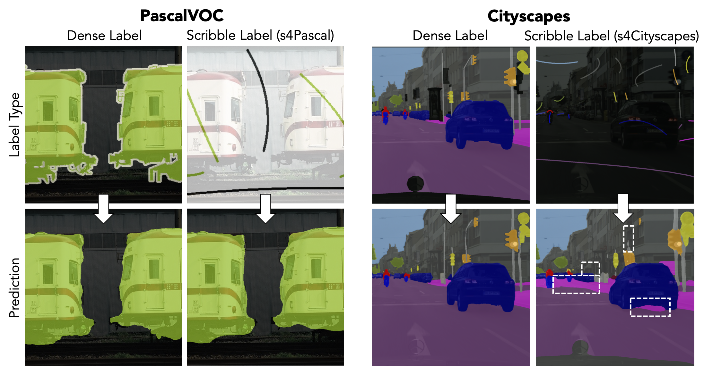
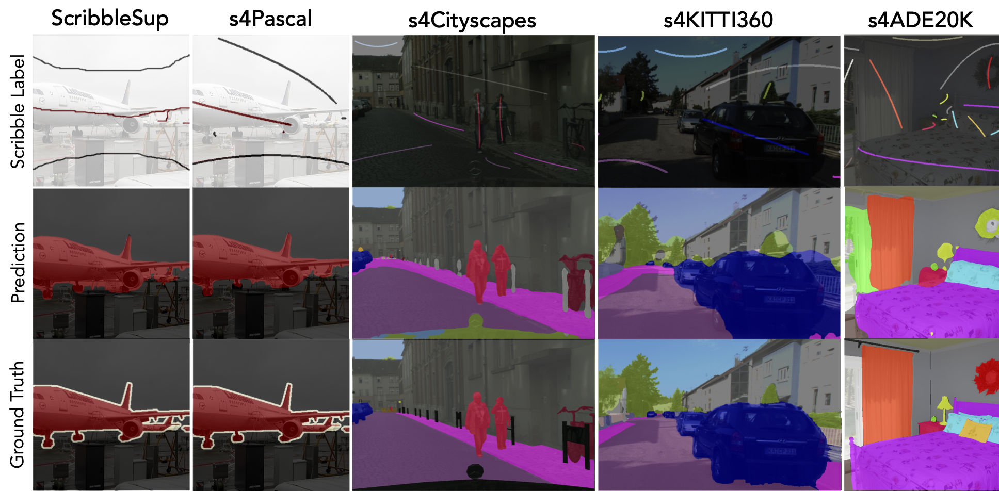
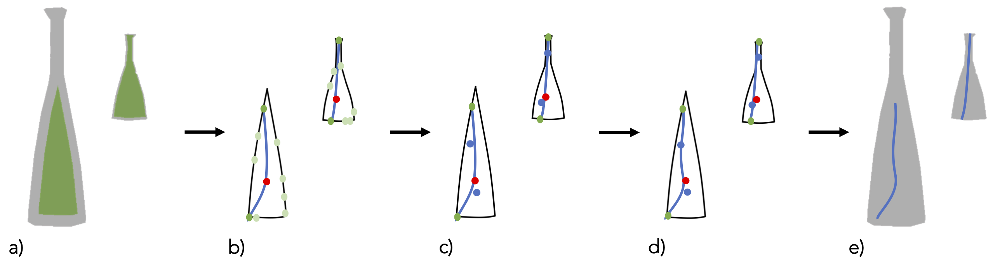

<!-- Using HTML to center the abstract -->
<script
  defer
  src="https://cdn.jsdelivr.net/npm/img-comparison-slider@8/dist/index.js"
></script>
<link
  rel="stylesheet"
  href="https://cdn.jsdelivr.net/npm/img-comparison-slider@8/dist/styles.css"
/>
<div class="columns is-centered has-text-centered">
    <div class="column is-four-fifths">
        <h2>Abstract</h2>
        <div class="content has-text-justified">
In this work, we introduce Scribbles for All, a label and training data generation 
algorithm for semantic segmentation trained on scribble labels. Training or
fine-tuning semantic segmentation models with weak supervision has become an
important topic recently and was subject to significant advances in model quality.
In this setting, scribbles are a promising label type to achieve high quality segmen-
tation results while requiring a much lower annotation effort than usual pixel-wise
dense semantic segmentation annotations. The main limitation of scribbles as
source for weak supervision is the lack of challenging datasets for scribble segmentation, 
which hinders the development of novel methods and conclusive evaluations.
To overcome this limitation, Scribbles for All provides scribble labels for several
popular segmentation datasets and provides an algorithm to automatically generate
scribble labels for any dataset with dense annotations, paving the way for new
insights and model advancements in the field of weakly supervised segmentation.
In addition to providing datasets and algorithm, we evaluate state-of-the-art segmentation 
models on our datasets and show that models trained with our synthetic
labels perform competitively with respect to models trained on manual labels.
Thus, our datasets enable state-of-the-art research into methods for scribble-labeled
semantic segmentation. The datasets, scribble generation algorithm, and baselines
are publicly available <a href="https://github.com/wbkit/Scribbles4All">here</a>.
        </div>
    </div>
</div>

---

## Which problem does Scribbles4All(s4) solve?



<!-- The primary limitation of scribbles as a source for weak supervision is the lack of challenging datasets for 
scribble segmentation. This impedes the development of novel methods and conclusive evaluations.

Nevertheless, at present, only one widely used segmentation dataset with scribble labels is available, 
namely ScribbleSup, for the PascalVOC dataset. Two challenges emerge for the research area of scribble-supervised 
segmentation methods. Firstly, generalization of methods to other datasets cannot be verified. Secondly, PascalVOC
is too easy to serve as the sole benchmark for scribble-supervised methods as visualized above. It
consists mostly of images with one object class and the background class. By learning precise class
boundaries of the dominant background class, a model can already achieve high performance while
the challenge of learning object-to-object boundaries is less relevant. In contrast, modern semantic
segmentation is confronted with additional challenges such as small object instances (e.g. poles in Cityscapes)
or a large number of semantic classes (e.g. 150 classes in ADE20K), which cannot be properly
benchmarked with PascalVOC.

Scribbles for All provides an algorithm to create exactly those scribble-labelled datasets from any preexisting
segmentation dataset. Further, we provide an initial collection of four s4-datasets based on PascalVOC, ADE20K, 
Cityscapes and KITTI360 and also benchmark them.  -->
The primary limitation of scribbles as a source for weak supervision is the lack of challenging datasets for scribble segmentation. 
This impedes the development of novel methods and conclusive evaluations. Two challenges emerge for the research area of 
scribble-supervised segmentation methods. Firstly, generalization of methods to other datasets cannot be verified. Secondly, PascalVOC 
is too easy to serve as the sole benchmark for scribble-supervised methods as visualized above.

Therefore, we present Scribbles for All:
-	We present an algorithm to convert every densely-labelled dataset into a scribble supervised dataset
-	We provide an initial set of four scribble-supervised datasets based on popular segmentation datasets - s4-datasets based on PascalVOC, ADE20K, Cityscapes and KITTI360
-	We benchmark these datasets on SOTA weakly-supervised semantic segmentation methods

## How do the s4-datasets look like?


The images displayed above illustrate the scribble labels generated for the s4-datasets, superimposed on the 
scene image. Furthermore, a dense segmentation map is provided for comparison purposes, as well as the prediction 
of a state-of-the-art (SOTA) method trained on the s4-scribble dataset. Each instance on the original segmentation 
map is labelled with a scribble if it exceeds a minimum area threshold dependent on the dataset. Furthermore, this 
illustrates the necessity for more complex scribble datasets, which is addressed by this work. While the predictions 
for s4Pascal//ScribbleSup are very close to fully supervised standards,  the disparity between ground-truth and 
prediction is higher for the more complex datasets. This emphasises the greater difficulty posed by these datasets 
and establishes meaningful benchmarks for more sophisticated weakly supervised segmentation methods.

# How do SOTA methods perform on s4Datasets?

<div class="column is-four-fifths" style="display: flex; justify-content: space-between; gap: 10px; padding: 10px; text-align: center;">
    <div style="flex: 1; text-align: center; padding: 5px;">
        
            
            
        </img-comparison-slider>
    </div>
    <div style="flex: 1; text-align: center; padding: 5px;">
        
            
            
        </img-comparison-slider>
    </div>
    <div style="flex: 1; text-align: center; padding: 5px;">
        
            
            
        </img-comparison-slider>
    </div>
</div>

## How are the datasets generated?


The presented scribble generation algorithm takes an image with corresponding dense segmentation
labels as input and produces a single scribble, represented as a set of points, for each object in the
image. We formulate the following design objectives:
1. **Mimic human annotations.** The generated scribbles should approximately resemble scribbles
that human annotators draw. Specifically, they are supposed to be more coarse for larger, simple
geometries and more precise for detailed objects, as would be the case with hand-crafted labels.
Also, the scribble is expected to go roughly through the centre part of an object and not to come
too close to its margins for a large portion of its length.
2. **Probabilistic generation.** The generation of labels should occur in a probabilistic fashion to
prevent mean collapse when confronted with similar shapes, maintaining enough variance in the
labelling process.
3. **No boundary violation.** We also apply hard constraints that prevent scribbles from violating
any class boundaries.

The fundamental steps of the algorithm are outlined in the figure above.

a) Size dependent erosion, 
b) COM in red, sampling of points on
the edge in green, determination of the approx. farthest pair in darker green and tentative scribble
in blue 
c) Sampling of two extra points along the tentative scribble 
d) Fitting final scribble through
points 
e) Scribble overlayed on initial segmentation map.

For further details feel free to read the paper.

## Citation
```
@online{boettcherScribblesAllBenchmarking2024,
  title = {Scribbles for All: Benchmarking Scribble Supervised Segmentation Across Datasets},
  shorttitle = {Scribbles for All},
  author = {Boettcher, Wolfgang and Hoyer, Lukas and Unal, Ozan and Lenssen, Jan Eric and Schiele, Bernt},
  date = {2024-08-22},
  eprint = {2408.12489},
  eprinttype = {arXiv},
  eprintclass = {cs},
  doi = {10.48550/arXiv.2408.12489},
  url = {http://arxiv.org/abs/2408.12489},
  urldate = {2024-10-05},
  abstract = {In this work, we introduce Scribbles for All, a label and training data generation algorithm for semantic segmentation trained on scribble labels. Training or fine-tuning semantic segmentation models with weak supervision has become an important topic recently and was subject to significant advances in model quality. In this setting, scribbles are a promising label type to achieve high quality segmentation results while requiring a much lower annotation effort than usual pixel-wise dense semantic segmentation annotations. The main limitation of scribbles as source for weak supervision is the lack of challenging datasets for scribble segmentation, which hinders the development of novel methods and conclusive evaluations. To overcome this limitation, Scribbles for All provides scribble labels for several popular segmentation datasets and provides an algorithm to automatically generate scribble labels for any dataset with dense annotations, paving the way for new insights and model advancements in the field of weakly supervised segmentation. In addition to providing datasets and algorithm, we evaluate state-of-the-art segmentation models on our datasets and show that models trained with our synthetic labels perform competitively with respect to models trained on manual labels. Thus, our datasets enable state-of-the-art research into methods for scribble-labeled semantic segmentation. The datasets, scribble generation algorithm, and baselines are publicly available at https://github.com/wbkit/Scribbles4All},
  pubstate = {prepublished},
  keywords = {Computer Science - Computer Vision and Pattern Recognition}
}
```
